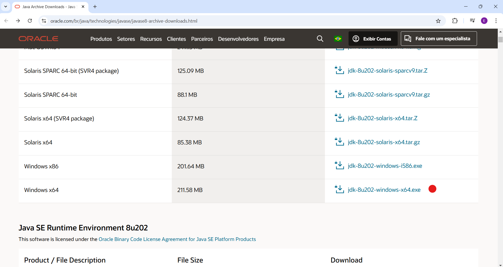
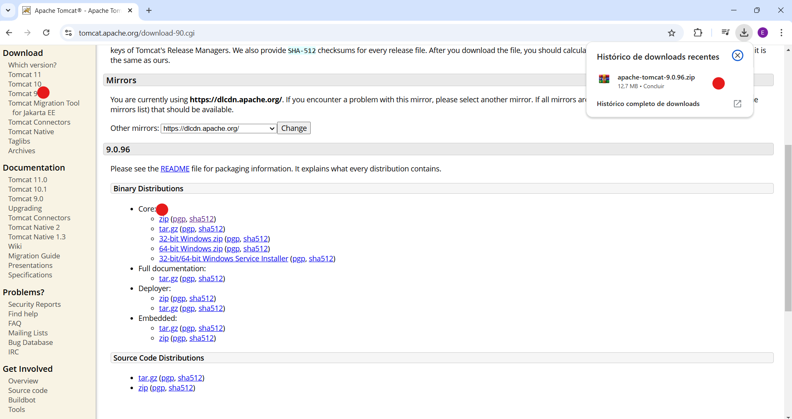
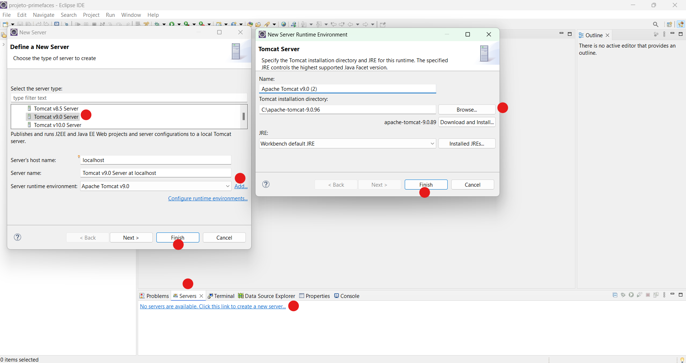
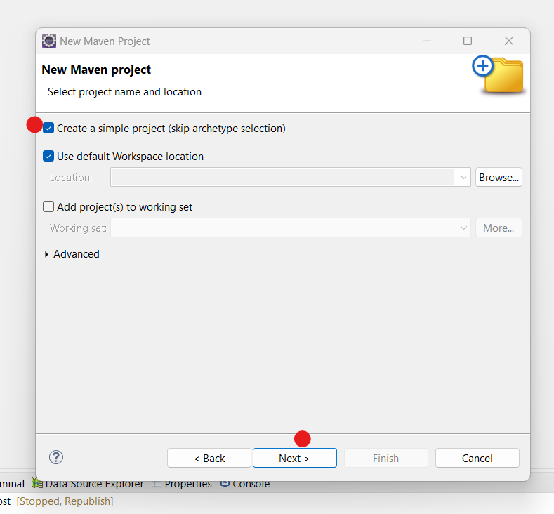
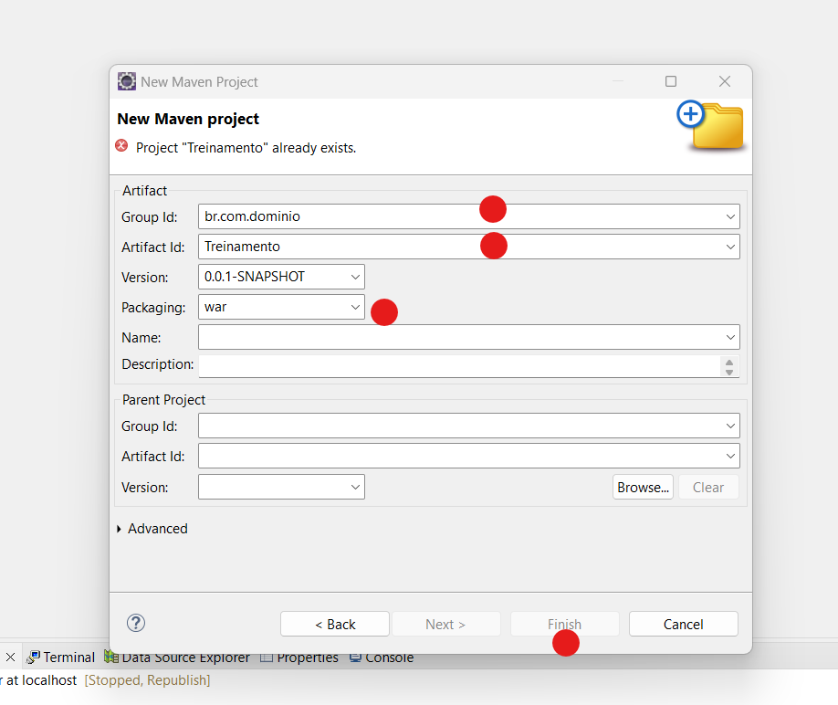
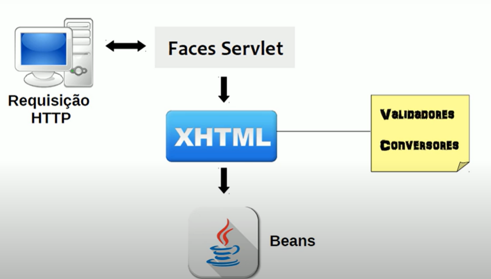
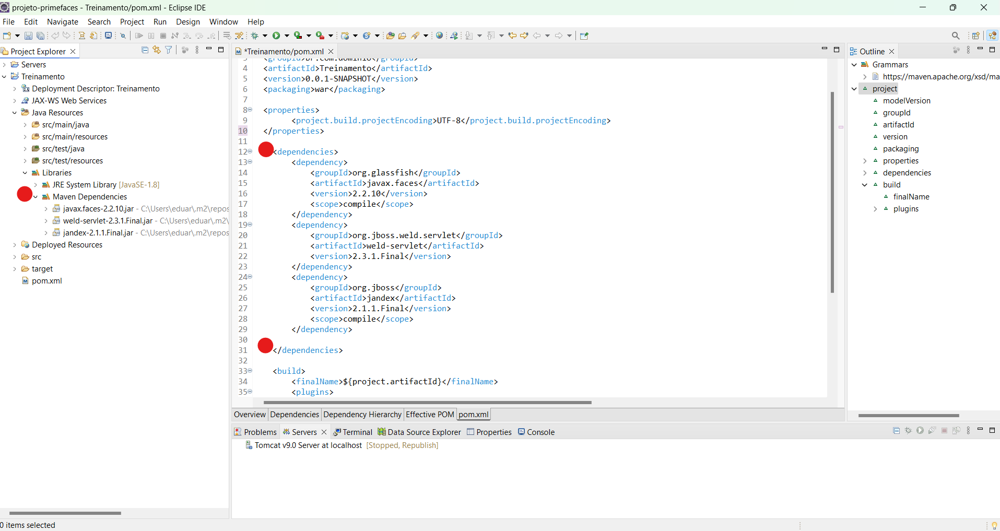
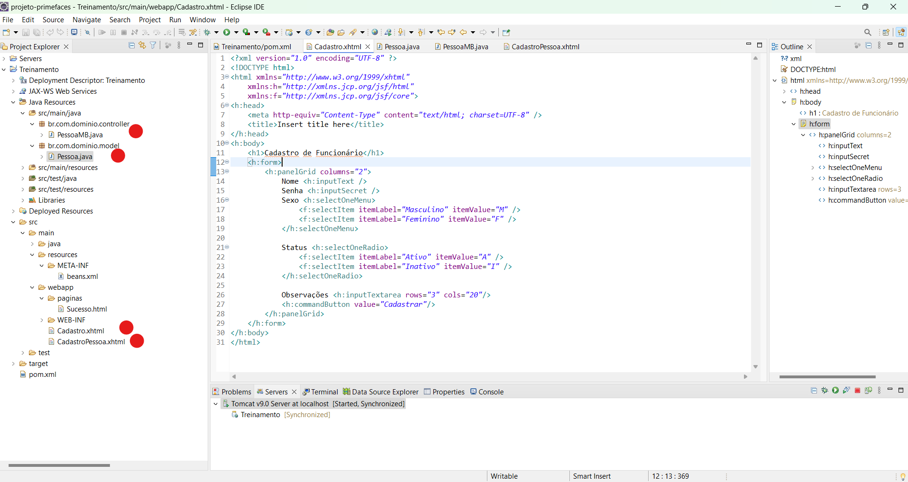

<h1 align="center">Conceitos Básicos de Java EE | JSF | Primefaces | Maven</h1>

<h3 align="center"> Canal do YouTube: <a href="https://www.youtube.com/watch?v=xdbdfUmPd8c&list=PLnOrFdw5rkTyj3km618OLh5nCatSELRFh">Luiz Alberto</a> </h3>

## Introdução

> Fiz este passo a passo para fixar melhor o conteúdo

- Configurar um projeto web na IDE Eclipse
- Criar páginas web através dos componentes do JSF
- Criar interfaces sofisticadas com Primefaces
- Integrar as tecnologias CDI, Hibernate, JPA e Maven
- Gerenciar o container de aplicações Apache Tomcat

https://github.com/user-attachments/assets/85e35e3a-6345-401e-8803-1b1afaa52840

https://www.oracle.com/br/



https://tomcat.apache.org/



## Marcar a versão do Tomcat e colocar o diretório da pasta extraida do download



## Em Project Explorer -> botão direito - New - Other - Maven Project



## Trabalhar com sistema Web seleciona war



## No **pom.xml** é onde coloca as configurações principais e informa as bibliotecas do Maven

```xml
  <project xmlns="http://maven.apache.org/POM/4.0.0" xmlns:xsi="http://www.w3.org/2001/XMLSchema-instance" xsi:schemaLocation="http://maven.apache.org/POM/4.0.0 https://maven.apache.org/xsd/maven-4.0.0.xsd">
  <modelVersion>4.0.0</modelVersion>
  <groupId>br.com.dominio</groupId>
  <artifactId>Treinamento</artifactId>
  <version>0.0.1-SNAPSHOT</version>
  <packaging>war</packaging>

   <properties>
		<project.build.projectEncoding>UTF-8</project.build.projectEncoding>
   </properties>

   <build>
		<finalName>${project.artifactId}</finalName>
		<plugins>
			<plugin>
				<artifactId>maven-compiler-plugin</artifactId>
				<version>3.1</version>
				<configuration>
					<source>1.8</source>
					<target>1.8</target>
				</configuration>
			</plugin>
		</plugins>
	</build>
 </project>
```

## Introdução ao JSF

- JSF (Java Server Faces)
- É um framework Model View Controler - MVC (cada camada realiza uma função especifica no sistem, dividindo as responsabilidades) para desenvolvimento de aplicações web Java.

## Características do JSF

- Páginas criadas utilizando componentes simples (botões, campos de texto)

- Suporte a Ajax

- Possui validadores e conversores (converter um texto para uma data, número)

- Pode-se criar os próprios componemtes (Mojarra Oracle / MyFaces Apache)

- É um modelo orientado a eventos (determinado componente visual chama uma função no servidor)

- Se assemelha muito a criação de interfaces gráficas de aplicações desktop

## Formato XHTML

- Começou a ser usado a partir da versão 2.0 do JSF

- É baseado em XML, por isso tem um formato rígido em relação ao HTML

- O documento deve estar bem formatado se não, não vai funcionar, assim como ocorre em arquivos XML

## Funcionamento do JSF

- Quando vamos acessar uma página fazemos uma requisição http no navegador, essa requisição vai para um componente da arquitetura java EE, chamado faces Servlet, ele direciona essa requisição para uma determinada página XHTML, lá ela tem os conversores e validadores que são atrelados a ela, tem bean que é um componente java



## Adiconando dependências no Maven



## Template básico

```xml
<?xml version="1.0" encoding="UTF-8" ?>
<!DOCTYPE html>
<html xmlns="http://www.w3.org/1999/xhtml"
	xmlns:h="http://xmlns.jcp.org/jsf/html"
	xmlns:f="http://xmlns.jcp.org/jsf/core">
<h:head>
	<meta http-equiv="Content-Type" content="text/html; charset=UTF-8" />
	<title>Insert title here</title>
</h:head>
<h:body>

</h:body>
</html>
```

## Introdução ao CDI

- Acrônimo para Cotexts and Dependency Injection
- Integra front e back de maneira simples

## O que é um bean ?

- Construtor público sem parâmetros
- Possuem atributos
- Possuem métodos getters e setters para poderem acessar esses atributos

```xml
public class Pessoa {
    private Nome nome;
    public Pessoa() {
    }
    //getters e setters
}
```

## Implementando um bean CDI

```xml
@Named //quando especifica @Named é uma classe bean CDI
@RequestScoped // tem outros escopos
public class MeuBean implements Serializable // nossa classe pode ser em bytes {
    @Inject // na pagina ja consegui acessar os atributos de pessoa
    private Pessoa pessoa;
}
```

## Dependências do CDI

```xml
    <dependency>
			<groupId>org.jboss.weld.servlet</groupId>
			<artifactId>weld-servlet</artifactId>
			<version>2.3.1.Final</version>
		</dependency>
		<dependency>
			<groupId>org.jboss</groupId>
			<artifactId>jandex</artifactId>
			<version>2.1.1.Final</version>
			<scope>compile</scope>
	</dependency>
```

- Criar uma classe model e uma controler que vai ser o bean CDI, vai fazer a interação entre o modelo de Pessoa e a página JSF

**Cadastro.xhtml**

```xml
<?xml version="1.0" encoding="UTF-8" ?>
<!DOCTYPE html>
<html xmlns="http://www.w3.org/1999/xhtml"
	xmlns:h="http://xmlns.jcp.org/jsf/html"
	xmlns:f="http://xmlns.jcp.org/jsf/core">
<h:head>
	<meta http-equiv="Content-Type" content="text/html; charset=UTF-8" />
	<title>Cadastro de Funcionário</title>
</h:head>
<h:body>
	<h1>Cadastrar novo Funcionário</h1>
	<h:form>
		<h:panelGrid columns="2">
			Nome <h:inputText />
			Senha <h:inputSecret />
			Sexo <h:selectOneMenu>
				<f:selectItem itemLabel="Masculino" itemValue="M" />
				<f:selectItem itemLabel="Feminino" itemValue="F" />
			</h:selectOneMenu>

			Status <h:selectOneRadio>
				<f:selectItem itemLabel="Ativo" itemValue="A" />
				<f:selectItem itemLabel="Inativo" itemValue="I" />
			</h:selectOneRadio>

			Observações <h:inputTextarea rows="3" cols="20"/>
			<h:commandButton value="Cadastrar"/>
		</h:panelGrid>
	</h:form>
</h:body>
</html>
```

**CadastroPessoa.xhtml**

```xml
<?xml version="1.0" encoding="UTF-8" ?>
<!DOCTYPE html>
<html xmlns="http://www.w3.org/1999/xhtml"
	xmlns:h="http://xmlns.jcp.org/jsf/html"
	xmlns:f="http://xmlns.jcp.org/jsf/core"
	xmlns:ui="http://xmlns.jcp.org/jsf/facelets">
<h:head>
	<meta http-equiv="Content-Type" content="text/html; charset=UTF-8" />
	<title>Cadastro Pessoa</title>
</h:head>
<h:body>

	<h1>Cadastrar nova Pessoa</h1>
	<h:form>
			<h:panelGrid columns="2">
				<h:outputText value="Nome" />
				<h:inputText value="#{bean.pessoa.nome}" />
				<h:outputText value="E-mail" />
				<h:inputText value="#{bean.pessoa.email}"/>
				<h:outputText />
				<h:commandButton value="Adicionar" action="#{bean.adicionar}"/>
			</h:panelGrid>
	</h:form>

	<h1>Lista de Pessoas</h1>

	<h:dataTable value="#{bean.pessoas}" var="p" border = '1'>
		<h:column>#{p.nome}</h:column>
		<h:column>#{p.email}</h:column>
	</h:dataTable>
</h:body>
</html>
```

**Pessoa.java**

```xml
package br.com.dominio.model;

import java.io.Serializable;

public class Pessoa implements Serializable {

	/**
	 *
	 */
	private static final long serialVersionUID = 1L;

	private Integer id;
	private String nome;
	private String email;

	public Integer getId() {
		return id;
	}

	public void setId(Integer id) {
		this.id = id;
	}

	public String getNome() {
		return nome;
	}

	public void setNome(String nome) {
		this.nome = nome;
	}

	public String getEmail() {
		return email;
	}

	public void setEmail(String email) {
		this.email = email;
	}

	@Override
	public int hashCode() {
		final int prime = 31;
		int result = 1;
		result = prime * result + ((id == null) ? 0 : id.hashCode());
		return result;
	}

	@Override
	public boolean equals(Object obj) {
		if (this == obj)
			return true;
		if (obj == null)
			return false;
		if (getClass() != obj.getClass())
			return false;
		Pessoa other = (Pessoa) obj;
		if (id == null) {
			if (other.id != null)
				return false;
		} else if (!id.equals(other.id))
			return false;
		return true;
	}

}
```

**PessoaMB.java**

```xml
package br.com.dominio.controller;

import java.io.Serializable;
import java.util.ArrayList;
import java.util.List;

import javax.enterprise.context.SessionScoped;
import javax.inject.Inject;
import javax.inject.Named;

import br.com.dominio.model.Pessoa;

@Named("bean")
@SessionScoped
public class PessoaMB implements Serializable {

    private static final long serialVersionUID = 1L;

    @Inject
    private Pessoa pessoa;

    private List<Pessoa> pessoas = new ArrayList<>();

    public String adicionar() {
    		pessoas.add(pessoa);
    		limpar();
    		 return null;
        }


    private void limpar() {
        pessoa = new Pessoa();
    }

	public Pessoa getPessoa() {
		return pessoa;
	}

	public void setPessoa(Pessoa pessoa) {
		this.pessoa = pessoa;
	}

	public List<Pessoa> getPessoas() {
		return pessoas;
	}

	public void setPessoas(List<Pessoa> pessoas) {
		this.pessoas = pessoas;
	}


 }

```



## Introdução PrimeFaces

- Biblioteca de componentes (calendários, janelas modais, gráficos ) open source, para uso JSF

```xml
    	<dependency>
			<groupId>org.primefaces</groupId>
			<artifactId>primefaces</artifactId>
			<version>7.0</version>
		</dependency>
```

## Melhorando o aspecto com CSS

- Criar uma pasta resources dentro de webapp

## Entrada de dados com InputText

```xml
    	<h1>Campos de entrada de texto</h1>

	<p:messages autoUpdate="true" id="msg" />

	<h:form id="form">
		<p:panelGrid columns="2">
			<p:outputLabel value="Nome" for="nome" />

			<p:inputText id="nome" required="true"
				requiredMessage="O nome é obrigatório" styleClass="input-borda"
				maxlength="50" placeholder="Digite seu nome"
				title="O mouse está sobre o componente" />


		</p:panelGrid>
	</h:form>

```

## Senha e confirmação usando password

```xml
    <h1>Campos de password</h1>
	<p:messages autoUpdate="true" id="msg" />

	<h:form id="form">
    <p:panelGrid columns="2">
        <p:outputLabel value="Senha" for="senha" />
        <p:password id="senha" feedback="true" weakLabel="Muito fraca"
                    goodLabel="Senha razoável" strongLabel="Senha forte" inline="true"
                    promptLabel="Informe uma senha" match="confirma" required="true"
                    requiredMessage="A senha é obrigatória"
                    validatorMessage="A senha e a confirmação estão diferentes" />

        <p:outputLabel value="Confirme a senha" for="confirma" />
        <p:password id="confirma" match="senha" required="true"
                    requiredMessage="A confirmação é obrigatória" />
    </p:panelGrid>

    <br />

    <p:commandButton value="Cadastrar senha" icon="ui-icon-disk" actionListener="#{bean.cadastrarSenha}" />
</h:form>
```

## Campos de observação com inputTextarea

```xml
<h1>Area de Texto</h1>

	<h:form>
		<p:inputTextarea id="descricao" rows="6" style="width: 50%"
			maxlength="10" placeholder="Descrição" counter="saida"
			counterTemplate="{0} caracteres restantes" />

		<br />
		<p:outputLabel id="saida" for="descricao" />
	</h:form>

```

## Barra de ferramentas e botões

```xml
<h1>Barra de ferramentas e botões</h1>

	<h:form id="form">
		<p:toolbar>
			<f:facet name="left">
				<p:button value="Novo" icon="ui-icon-document" />
				<p:button value="Abrir" icon="ui-icon-folder-open" />
				<span class="ui-separator"> <span
					class="ui-icon ui-icon-grip-dotted-vertical" />
				</span>
				<p:button icon="ui-icon-disk" />
				<p:button icon="ui-icon-trash" />
				<p:button icon="ui-icon-print" />
			</f:facet>
			<f:facet name="right">
				<p:menuButton value="Opções">
					<p:menuitem value="Salvar" icon="ui-icon-disk" />
					<p:menuitem value="Alterar" icon="ui-icon-arrowrefresh-1-w" />
					<p:menuitem value="Deletar" icon="ui-icon-trash" />
				</p:menuButton>
			</f:facet>
		</p:toolbar>
	</h:form>
```

## Layout, LayoutUnit e Editor

```xml
<p:layout fullPage="true">
		<p:layoutUnit position="north" size="130" header="Topo do Layout">
			<header>
				<p:outputLabel styleClass="img-logo center">
					<p:graphicImage library="img" name="primefacesjsf.png" width="200" />
				</p:outputLabel>
			</header>
		</p:layoutUnit>

		<p:layoutUnit position="west" header="Menu lateral" resizable="true"
			collapsible="true" size="230">
			<h:form>
				<p:menu style="width: 100%">
					<p:menuitem value="Cadastro" />
					<p:menuitem value="Consulta" />
					<p:menuitem value="Sair" />
				</p:menu>
			</h:form>
		</p:layoutUnit>

		<p:layoutUnit position="center">
			<h:form>
				<p:editor />
			</h:form>
		</p:layoutUnit>
	</p:layout>

```

## SelectOneMenu estático

```xml
<h1>SelectOneMenu</h1>

	<h:form id="form">
		<p:panelGrid columns="2">
			<h:outputText value="Evento" />
			<p:selectOneMenu value="#{atividadeMB.atividade.nome}" filter="true">
				<f:selectItem itemLabel="Semana de Administração"
					itemValue="evento 1" />
				<f:selectItem itemLabel="Semana do meio ambiente"
					itemValue="evento 2" />
				<f:selectItem itemLabel="Workshop de programação"
					itemValue="evento 3" />
			</p:selectOneMenu>\

			<p:commandButton value="Enviar" update="label" />
			<p:outputLabel value="#{atividadeMB.atividade.nome}" id="label" />
		</p:panelGrid>
	</h:form>
```

## SelectOneRadio e renderização com ajax

```xml
<h:form id="form">
		<p:panelGrid columns="2">
			<p:selectOneRadio value="#{clienteMB.tipoPessoa}">
				<f:selectItem itemLabel="Física" itemValue="FISICA" />
				<f:selectItem itemLabel="Jurídica" itemValue="JURIDICA" />
				<p:ajax event="click" update="input" process="@this" />
			</p:selectOneRadio>
			<h:panelGroup id="input">
				<p:inputMask mask="999.999.999-99" value="#{clienteMB.cpf}" id="cpf"
					rendered="#{clienteMB.tipoPessoa eq 'FISICA'}" required="true" />
				<p:inputMask mask="99.999.999/9999-99" value="#{clienteMB.cnpj}"
					id="cnpj" rendered="#{clienteMB.tipoPessoa eq 'JURIDICA'}"
					required="true" />
			</h:panelGroup>
		</p:panelGrid>
	</h:form>

```

## Entendendo o sistema de Grid

```xml
<h:form id="form">
		<p:panelGrid columns="2" layout="grid" styleClass="ui-fluid"
			style="margin-top: 120px;"
			columnClasses="ui-grid-col-4, ui-grid-col-8">
			<p:outputLabel value="Campo 1" />
			<p:inputText />

			<p:outputLabel value="Campo 2" />
			<p:inputText />

			<p:outputLabel value="Campo 3" />
			<p:inputText />

			<p:outputLabel value="Campo 4" />
			<p:inputText />

			<p:outputLabel value="Campo 5" />
			<p:inputText />

			<p:outputLabel value="Campo 6" />
			<p:inputText />
		</p:panelGrid>
	</h:form>
```

## Template - MENU GENERICO

```xml
<?xml version="1.0" encoding="UTF-8" ?>
<!DOCTYPE html>
<html xmlns="http://www.w3.org/1999/xhtml"
	xmlns:h="http://xmlns.jcp.org/jsf/html"
	xmlns:f="http://xmlns.jcp.org/jsf/core"
	xmlns:ui="http://xmlns.jcp.org/jsf/facelets"
	xmlns:p="http://primefaces.org/ui">

<head>
<meta http-equiv="Content-Type" content="text/html; charset=UTF-8" />
<h:outputStylesheet library="css" name="file.css" />
<link rel="shortcut icon" type="image/x-icon"
	href="${resource['img/favicon.png']}" />

<title>Treinamento</title>
</head>

<body>
	<header>
		<p:outputLabel styleClass="img-logo center">
			<p:graphicImage library="img" name="primefacesjsf.png" width="200" />
		</p:outputLabel>
	</header>

	<ui: insert name="corpo"/>

	<footer> <h2>Rodapé da página ===================</h2></footer>
</body>

</html>

```

## Dependências SQL

```xml
		<dependency>
			<groupId>org.hibernate</groupId>
			<artifactId>hibernate-core</artifactId>
			<version>4.3.8.Final</version>
			<scope>compile</scope>
		</dependency>
		<dependency>
			<groupId>org.hibernate</groupId>
			<artifactId>hibernate-entitymanager</artifactId>
			<version>4.3.9.Final</version>
			<scope>compile</scope>
		</dependency>
		<dependency>
			<groupId>postgresql</groupId>
			<artifactId>postgresql</artifactId>
			<version>9.1-901-1.jdbc4</version>
			<scope>compile</scope>
		</dependency>
```

**persistence.xml**

> CursoPU: parâmetro é o valor que vai ser uzado nas classes java que vão executar as persistencias

> Provider: indica o que está utilizando = hibernate

> Properties: informações básicas do banco de dados

> hibernate.hbm2ddl.auto: 'update' sempre que reiniciar o servidor ou recompilar o projeto, ele atualiza as tabelas

> hibernate.show_sql: 'true' vai mostrar o script que esta executando no projeto

> hibernate.format_sql: vai formatar o código

> hibernate.dialect: informa qual banco de dados estamos utilizando

```xml
<?xml version="1.0" encoding="UTF-8"?>
<persistence version="2.1"
    xmlns="http://xmlns.jcp.org/xml/ns/persistence"
    xmlns:xsi="http://www.w3.org/2001/XMLSchema-instance"
    xsi:schemaLocation="http://xmlns.jcp.org/xml/ns/persistence
    http://xmlns.jcp.org/xml/ns/persistence/persistence_2_1.xsd">

    <persistence-unit name="CursoPU">
        <provider>org.hibernate.jpa.HibernatePersistenceProvider</provider>

        <properties>
            <property name="javax.persistence.jdbc.url" value="jdbc:postgresql://localhost:5432/medicamentos" />
            <property name="javax.persistence.jdbc.driver" value="org.postgresql.Driver" />
            <property name="javax.persistence.jdbc.user" value="postgres" />
            <property name="javax.persistence.jdbc.password" value="123456" />

            <property name="hibernate.hbm2ddl.auto" value="update" />
            <property name="hibernate.show_sql" value="true" />
            <property name="hibernate.format_sql" value="true" />
            <property name="hibernate.dialect" value="org.hibernate.dialect.PostgreSQL9Dialect" />
        </properties>
    </persistence-unit>
</persistence>

```

## �� Tecnologias

<div>
  
  
       
  
  
  
  
  
  
  
                
</div>
